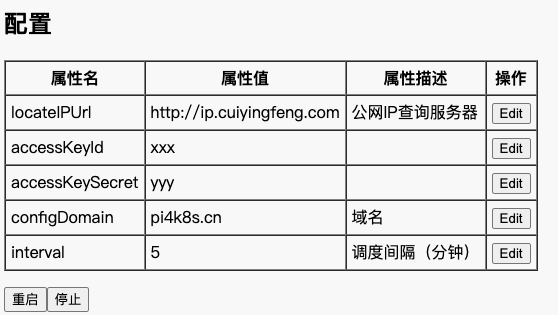

# 基于阿里云SDK构建的DDNS

使用本工具可以随时检测本地的公网IP，和指定域名当前的解析IP，一旦发现不一致，就可以将域名解析到一个变化的公网IP上。本工具基于阿里云SDK，使用java开发。

本工具对于需要架设互联网服务但又苦于没有固定公网IP的童鞋使用，理论上本工具可以替代花生壳等动态域名服务。相比之前版本，最大区别是提供了页面配置阿里云SDK参数和需要解析的DDNS，并且支持多DDNS。

要求：域名托管在阿里云，阿里云开通access Key服务，相关服务器装jdk1.8及以上运行环境或者docker环境


### 使用方法
#### 阿里云购买域名，并开通access Key服务 


#### 下载源码并编译
```
git clone https://gitee.com/fastjrun/ddns.git
cd ddns
sh build.sh package_server
```
output目录下生成ddns.jar
#### 部署
##### 原生部署
将ddns.jar和ddns.sh部署到服务器同一目录下，比如/opt/ddns
```
cd /opt/ddns
# 采用后台部署方式
INIT=always nohup sh ddns.sh &
```
##### 容器化部署
也可以通过docker镜像pi4k8s/ddns:3.0进行部署，这个镜像不仅可以在一般x86服务器使用，也可以在树莓派4B上直接使用
```
docker run -itd --name ddns -p 8080:8080 pi4k8s/ddns:3.0
```
#### 使用
- 配置阿里云api参数 

http:{ip}:8080/config.html

  

点击停止按钮可以停止调度任务。点击重启按钮可以以新设置的参数重新启动调度任务。

- 配置ddns记录

http:{ip}:8080/ddns.html


通过本页面可添加ddns记录，添加完记录后需要等一段时间才能生效，这里支持配置多条ddns记录。